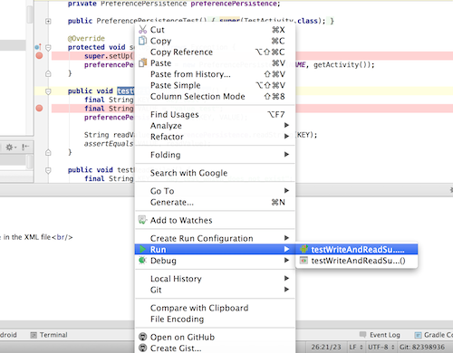
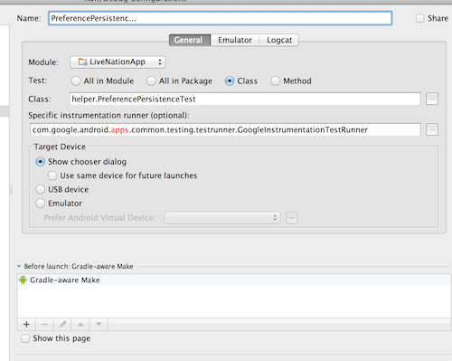

adr-appLiveNation
=================

Live Nation 2 for Android, the cause and solution of all Live Nation 2 for Android's problems.

Building
========

To build the Live Nation app you will need to install [Android Studio](http://developer.android.com/sdk/installing/studio.html).

To begin, you will need to clone three repositories onto your computer:

	git clone git@github.com:TeamSidewinder/adr-appLiveNation.git adr-appLiveNation
	git clone git@github.com:TeamSidewinder/adr-libsLabsPlatform.git adr-libsLabsPlatform
	git clone git@github.com:TeamSidewinder/adr-libTicketing.git adr-libTicketing

Once the repositories have been cloned, you will import the adr-appLiveNation project into Android Studio. After import, you will need to install any required SDK components:

Open the Android SDK Manager from Android Studio via the Tools->Android->SDK Manager, and make sure that..

a) Any item with “Update” as its status is selected
b) That the following items are selected: 

	[x] Android 4.4.2 API 19: SDK Platform
	[x] Android 4.0 API 14: SDK Platform (for Facebook SDK)
	[x] Extras: Google Play Services
	[x] Extras: Google Repository

For good luck, select Tools->Android->Sync project with Gradle Files, close and re-open Android Studio, and/or select the File->Synchronize menu option.

Now you need to update your properties to be able to build in debug and releae mode.
Go to Users/username/.gradle
Open the gradle.properties file. If it does not exist create it.

Copy and paste the following variable names and update paths and passwords.

	LNReleaseStoreFile= .../livenation-release-key.keystore
	LNStorePassword=
	LNKeyAlias=livenation_alias
	LNKeyPassword= ...

It will then be possible to build and run the project.
Running lint
=========================
You can run only lint

	./gradlew lint
or you can assemble the project and run lint

	./gradlew check
	
It generated 2 reports

* lint-report.html [open][lint1]
* lint-report.xml [open][lint2]

[lint1]: LiveNationApp/lint-report.html
[lint2]: LiveNationApp/lint-report.xml

Running tests
=========================

The following command run the sets of test of the application but also the tests of the Ticketing library and the Platform Library.

It generates 3 apk in project/build/outputs/apk:

* LiveNationApp-debug-test-unaligned.apk [Folder link][link1]
* LabsPlatform-debug-test-unaligned.apk [Folder link][link2]
* Ticketing-debug-test-unaligned.apk [Folder link][link3]

[link1]: LiveNationApp/build/outputs/apk
[link2]: ../adr-libsLabsPlatform/LabsPlatform/build/outputs/apk
[link3]: ../adr-libTicketing/Ticketing/build/outputs/apk

and 3 reports in project/build/outputs/reports/androidTests/connected called index.html.

	./gradlew test
	

###To run a single project

You need to specify the module before to launch the command

	./gradlew :Ticketing:connectedCheck
	./gradlew :LabsPlatform:connectedCheck
	./gradlew :LiveNationApp:connectedCheck
	
###To run a single test

To run one test at a time, rigth click on the method name or the class test and click on run. 

===

Do not forget to specify in the run/debug configuration the specific instrumentation runner as com.google.android.apps.common.testing.testrunner.GoogleInstrumentationTestRunner

Code coverage
=========================

To generate the code coverage reports, run 
 
	./gradlew createDebugCoverageReport
	
Because the task connectedCheck and test depends on createDebugCoverageReport, you can also run 

	./gradlew connectedCheck

or

	./gradlew test

The reports are generated under build/outputs/reports/coverage in each project.

* LiveNationApp [Folder link][link1cov]
* LabsPlatform [Folder link][link2cov]
* Ticketing [Folder link][link3cov]

[link1cov]: LiveNationApp/build/outputs/reports/coverage/debug/index.html
[link2cov]: ../adr-libsLabsPlatform/LabsPlatform/build/outputs/reports/coverage/debug/index.html
[link3cov]: ../adr-libTicketing/Ticketing/build/outputs/reports/coverage/debug/index.html